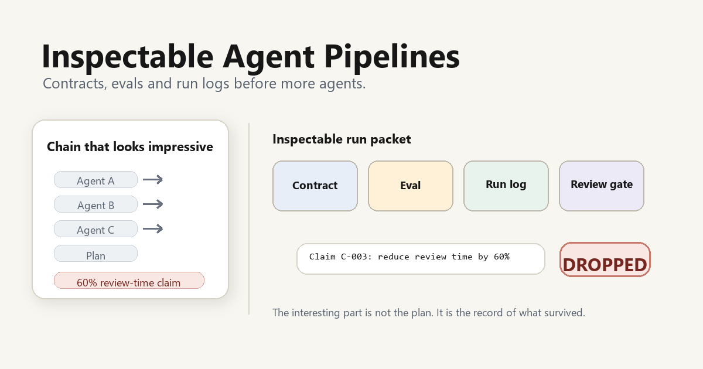
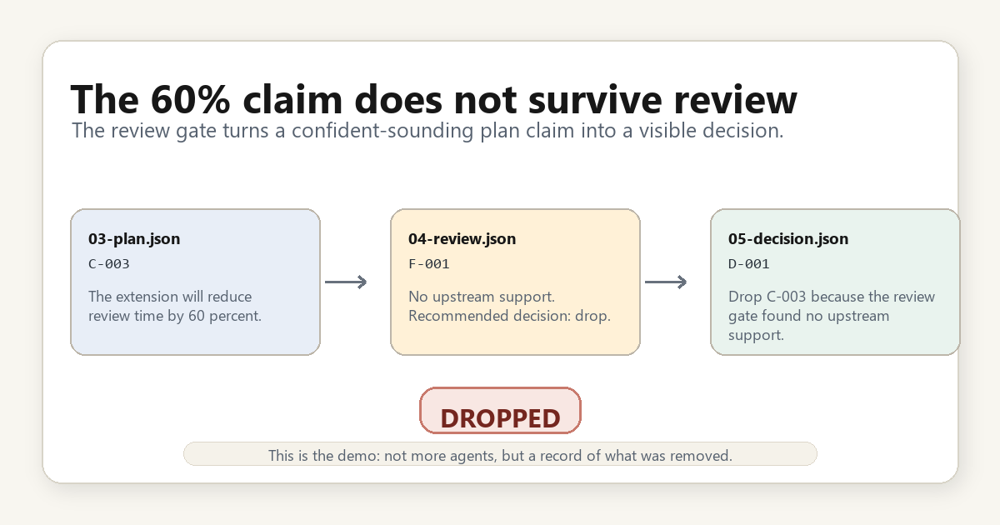
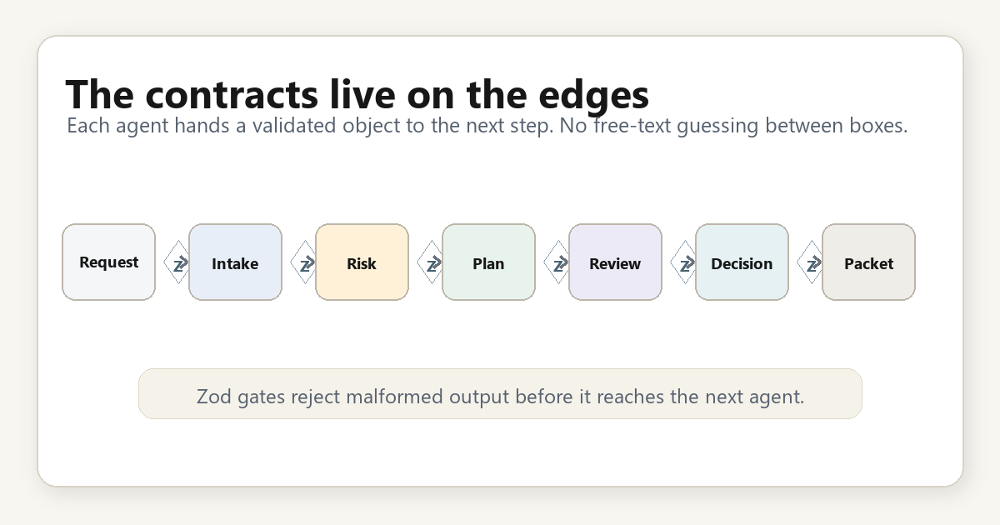
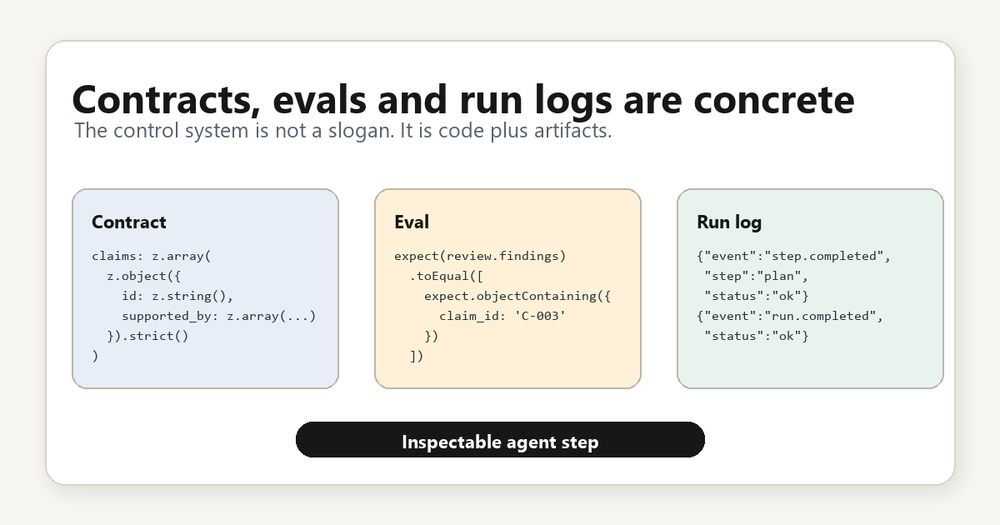

# Inspectable Agent Pipelines

Agentic workflows need contracts, evals and run logs before they need more agents.



This repository is a small TypeScript reference project for building agent pipelines that can be inspected after they run.

The default demo does not call an LLM. It uses deterministic mock agents so the engineering pattern is visible: Zod contracts, validated outputs, eval-style tests, JSONL run logs, review findings and a final run packet.

## Why not just chain agents?

A simple agent chain can look impressive:

1. Agent A reads a request.
2. Agent B identifies risks.
3. Agent C writes a plan.
4. The final answer sounds useful.

The problem starts later, when someone asks what happened:

- Which step produced which claim?
- Did the next step receive valid structured input?
- Did unsupported assumptions enter the plan?
- Did the pipeline fail loudly or silently?
- Can a reviewer inspect the run without reading a transcript?

This repo shows the boring but useful version: every step has a contract, every output is validated, every run writes a log, and the review gate catches unsupported claims before they enter the final brief.

## What the demo does

Input:

> Build a browser extension that summarizes long procurement notices for small suppliers.

Pipeline:

1. `intake-agent` extracts goal, users, constraints and unknowns.
2. `risk-agent` flags ambiguity and unsupported assumptions.
3. `plan-agent` produces a small implementation brief.
4. `review-gate` checks whether plan claims have upstream support.
5. `decision-writer` writes the final brief and decision log.

The plan intentionally contains one unsupported claim:

> The extension will reduce review time by 60 percent.

The review gate drops it because no upstream evidence supports it.

That is the point of the demo.



## Show the receipts

This repo should not ask you to trust prose about inspectability. The artifacts are visible.

The contract is code:

```ts
claims: z.array(
  z.object({
    id: z.string().min(1),
    text: z.string().min(1),
    supported_by: z.array(z.string().min(1)),
  }).strict(),
)
```

The run log is a real JSONL file:

```json
{"event":"step.completed","step":"plan","status":"ok","duration_ms":5}
{"event":"step.completed","step":"review","status":"ok","duration_ms":8}
```

The unsupported claim is visible in `examples/runs/sample-run/04-review.json`:

```json
{
  "claim_id": "C-003",
  "finding": "Claim \"The extension will reduce review time by 60 percent.\" has no upstream support.",
  "recommended_decision": "drop"
}
```

The final decision is visible in `examples/runs/sample-run/05-decision.json`:

```json
{
  "finding_id": "F-001",
  "decision": "drop",
  "reason": "Drop C-003 because the review gate found no upstream support."
}
```

## Quick start

```bash
npm install
npm test
npm run demo
```

The demo writes an inspectable packet to:

```text
examples/runs/sample-run/
```

Key files:

- `01-intake.json`
- `02-risk.json`
- `03-plan.json`
- `04-review.json`
- `05-decision.json`
- `run.jsonl`
- `decision-log.md`
- `final-brief.md`


## What this proves

- Contracts catch malformed agent output.
- Evals catch workflow regressions.
- Run logs make a run inspectable.
- Review gates catch unsupported claims before they become polished prose.
- A useful agent demo can run without API keys or hidden live dependencies.

## What this is not

- Not an agent framework.
- Not a claim that mocks replace live model testing.
- Not a production observability stack.
- Not a benchmark for LLM quality.
- Not an autonomous coding system.

## Architecture

The core loop is small. Each agent output is validated with Zod before it reaches the next step.





Read more:

- [Architecture](docs/architecture.md)
- [Review gates](docs/review-gates.md)
- [Public/private boundary](docs/public-private-boundary.md)

## Tests

```bash
npm test
```

Current test coverage:

- happy-path pipeline creates all expected run-packet files,
- default mock outputs validate against strict schemas,
- extra fields are rejected,
- malformed agent output stops the pipeline,
- unsupported plan claims are caught by the review gate.

## Relationship to structured AI research workflows

This repo is the code sibling of `structured-ai-research-workflows`.

- `structured-ai-research-workflows`: how AI-assisted research keeps claims, sources, reviews and decisions inspectable.
- `inspectable-agent-pipelines`: how agentic software workflows keep contracts, evals, run logs and decisions inspectable.

The first is about research discipline. This one is about engineering discipline.

## Status

Draft v0.1. The repo is intentionally small, offline-first and designed to be read in one sitting.
