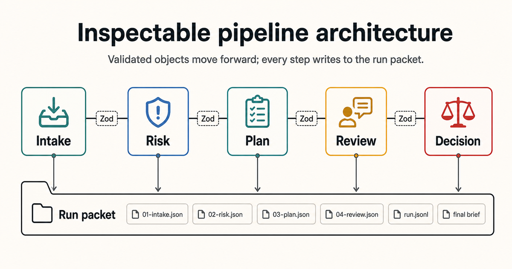

# Architecture

The demo is a walking skeleton for an agent pipeline.

It is intentionally small:

- no live model calls,
- no network dependencies,
- no hidden services,
- no orchestration framework.

The point is to show the shape of an inspectable pipeline before adding model complexity.

## Flow

## Contracts

Every agent output has:

- a schema version,
- a fixed agent identifier,
- a timestamp,
- strict Zod validation,
- an inferred TypeScript type.

The schema is the contract. Prompts, model providers and implementations can change later, but downstream code should not have to guess the output shape.

## Run Packet

`npm run demo` writes:

- input,
- one JSON file per step,
- a JSONL run log,
- a decision log,
- a final brief,
- a summary file.

That packet is the evidence surface. A reviewer can inspect what happened without relying on a chat transcript.

## Why Mocks First

Mocks are not the end state. They are the walking skeleton.

They prove:

- the pipeline shape works,
- validation is wired,
- logs are written,
- failures can be tested,
- final artifacts are produced.

Only after that should a live LLM adapter be added.
